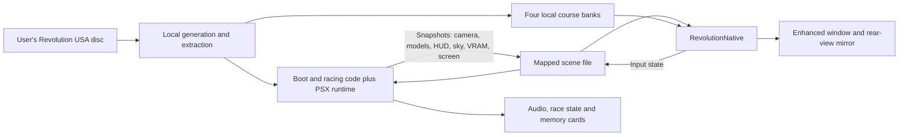

# Revolution architecture

## Boot and racing executable pipeline

Revolution uses a boot executable (`SLUS_002.14`) and a separate racing executable
(`RIDGE.EXE` extracted from the disc). [game.toml](../game.toml) identifies the
USA revision and boot layout; [CMakeLists.txt](../CMakeLists.txt) links the generated
boot shards together with the statically compiled overlay output.

[build-macos.sh](../scripts/build-macos.sh) builds PSXRecomp's tools, generates boot
code, inspects/extracts disc assets, discovers the racing overlay, regenerates
OpenBIOS code, configures the runtime codegen hash target, and compiles the overlay.
The hash stamp is checked before overlay compilation so generated code cannot
silently use an incompatible runtime. A second configuration incorporates the
new overlay code before the runtime and viewers are compiled.

The public upstream SDK revision plus three [patches](../patches) is sufficient:

- The Revolution code-generation patch recognizes its reserved division-guard
  instruction and emits a fail-fast guard, rather than silently dropping it.
  Its synthetic regression checks both emitted forms without using disc content.
- The registration patch makes that regression visible to CTest and satisfies
  the framework's test-registration completeness check.
- The shared OpenGL patch flushes queued GPU drawing before readback consumes
  dirty regions, keeping subsequent CPU reads coherent.

[apply-runtime-patches.sh](../scripts/apply-runtime-patches.sh) is idempotent and
does not update upstream revisions. Never depend on a private SDK commit or edit
generated C as the durable implementation.

## Local assets

[inspect_assets.py](../tools/inspect_assets.py) verifies the supplied data-track
identity and parses course/model/texture container boundaries. Extracted disc
files remain under ignored `disc/files/`.
[prepare_native_assets.py](../tools/prepare_native_assets.py) produces four local
course banks (`EASY`, `MID`, `HIGH`, `OLDE`) under `build-macos/native-scene/`.
It combines course sections, car and scenery model banks, material keys, texture
windows and initial VRAM data. Runtime VRAM supplies subsequent palette/texture
updates. Terrain and panel repairs are narrowly guarded by the expected USA
geometry; do not generalize them to other assets without verification.

These outputs contain game content. They are build products, not source assets.
Another contributor must produce them from their own supported disc.

## Two cooperating processes

The original game owns simulation, physics, race logic, audio and saves.
[launcher/native_scene.py](../launcher/native_scene.py) owns both children and
terminates them when either exits. A temporary companion directory isolates its
window settings while both Revolution modes use Revolution's saves. The original
window remains necessary during boot: the scene bridge starts in the racing
executable, so hiding the companion at creation would hide startup interaction.

## Scene capture and transport

[live.c](../src/scene/live.c) observes Revolution's verified submission boundaries,
collects model/HUD/sky data and publishes a snapshot. Enhanced scene candidates
are currently states 17 and 19 with a recognized course and initialized model
state. Other delivered states use the original framebuffer. This does not imply
that every intro/replay state is covered.

[shared.h](../src/scene/shared.h) defines a fixed-layout mapped structure with a
magic/version, size, sequence, publication timestamp and bounded arrays. A snapshot
contains up to 512 models, HUD/sky words, full VRAM and original-screen pixels.
The producer and viewer use nonblocking `flock` around exchange; contention skips
visual publication/consumption rather than blocking the simulation. The viewer
copies a complete snapshot before decoding and writes input into the shared block.
This is local POSIX IPC, not the datagram protocol used by Ridge Racer.

The snapshot is large, so copying and VRAM processing remain costs to measure.
Changes to its layout must update producers, consumers and readers together.
Magic/size/count checks do not make mismatched versions compatible.

[submission_eval.cpp](../src/scene/submission_eval.cpp) evaluates supported
scenery/car submission paths using private working memory and bounded output.
It must not mutate authoritative game RAM or CPU state. Extended visibility
retains game-specific animation and state rules rather than drawing every model
unconditionally. Rear-view submissions have a separate pass/matrix identity.

## Presentation and rendering

[native.cpp](../src/scene/native.cpp) latches monotonic time before variable snapshot
and VRAM work and uses it for both main and mirror interpolation. The
[presentation timeline](../src/scene/presentation_timeline.h) buffers up to eight
frames and samples behind current source time by an estimated source interval
plus one display interval. It holds when interpolation data is unavailable; it
does not advance physics or extrapolate a new game state.

[timeline.h](../src/scene/timeline.h) matches component motion by identity even
when wheel meshes alternate. State/camera discontinuities remain cuts. The
background panorama has its own interpolation; HUD animation and some appearance
changes still update at source rate.

[mesh.h](../src/scene/mesh.h) decodes geometry and live material changes.
[texture_data.h](../src/scene/texture_data.h) caches page/palette signatures,
ignores irrelevant live-page changes for resident indexed textures and expands
palette colours once per decode. Dirty textures are uploaded when visible;
legitimate updates still use full synchronous texture uploads.

[depth_renderer.h](../src/scene/depth_renderer.h) batches a streaming vertex buffer
and preserves SDL/OpenGL state. Authored road layers currently use a depth tolerance;
this is not Ridge Racer's newer tagged car/contact shader. Mirror, lighting,
transparency and HUD fidelity require their own comparisons.

[display_pacer.h](../src/scene/display_pacer.h) waits for Mac display callbacks
before drawing when applicable, with fallback to SDL V-sync. Asynchronous metrics,
delayed GPU queries and camera traces help distinguish render-loop timing, source
motion and submission variation. None directly measures physical scanout.
