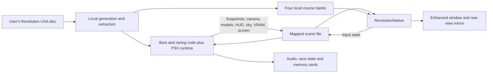

# Revolution architecture

## Boot and racing executable pipeline

Revolution uses a boot executable (`SLUS_002.14`) and a separate racing executable
(`RIDGE.EXE` extracted from the disc). [game.toml](../game.toml) identifies the
USA revision and boot layout; [CMakeLists.txt](../CMakeLists.txt) links the generated
boot shards together with the statically compiled overlay output.

[build-macos.sh](../scripts/build-macos.sh) builds PSXRecomp's tools, generates boot
code, inspects/extracts disc assets, discovers the racing overlay, regenerates
OpenBIOS code, configures the runtime codegen hash target, and compiles the overlay.
The hash stamp is checked before overlay compilation so generated code cannot
silently use an incompatible runtime. A second configuration incorporates the
new overlay code before the runtime and viewers are compiled.

The public upstream SDK revision plus the [patches](../patches) is sufficient:

- The Revolution code-generation patch recognizes its reserved division-guard
  instruction and emits a fail-fast guard, rather than silently dropping it.
  Its synthetic regression checks both emitted forms without using disc content.
- The registration patch makes that regression visible to CTest and satisfies
  the framework's test-registration completeness check.
- The shared OpenGL patch flushes queued GPU drawing before readback consumes
  dirty regions, keeping subsequent CPU reads coherent.
- The shared hidden-companion patch creates the runtime window hidden in Enhanced
  mode, without removing its GL context, GPU work or original frame pacing.

[apply-runtime-patches.sh](../scripts/apply-runtime-patches.sh) is idempotent and
does not update upstream revisions. Never depend on a private SDK commit or edit
generated C as the durable implementation.

## Local assets

[inspect_assets.py](../tools/inspect_assets.py) verifies the supplied data-track
identity and parses course/model/texture container boundaries. Extracted disc
files remain under ignored `disc/files/`.
[prepare_native_assets.py](../tools/prepare_native_assets.py) produces four local
course banks (`EASY`, `MID`, `HIGH`, `OLDE`) under `build-macos/native-scene/`.
It combines course sections, car and scenery model banks, material keys, texture
windows and initial VRAM data. Runtime VRAM supplies subsequent palette/texture
updates. Terrain and panel repairs are narrowly guarded by the expected USA
geometry; do not generalize them to other assets without verification.

These outputs contain game content. They are build products, not source assets.
Another contributor must produce them from their own supported disc.

## Two cooperating processes

The original game owns simulation, physics, race logic, audio and saves.
[launcher/native_scene.py](../launcher/native_scene.py) owns both children and
terminates them when either exits. A temporary companion directory isolates its
window settings while both Revolution modes use Revolution's saves. Enhanced
mode sets `PSX_HIDDEN_COMPANION=1` from creation. The original GPU remains active;
it supplies boot/2D frames and game state, but does not expose a second window.
`REVOLUTION_VISIBLE_COMPANION=1` is a launcher opt-out for diagnostics.

## Scene capture and transport

Before the racing executable takes over, a runtime frame hook in
[live.c](../src/scene/live.c) captures the displayed framebuffer after normal
controller sampling. [screen_capture.h](../src/scene/screen_capture.h) uses GPU
readback for both 15-bit colour and packed RGB24 screens, validating dimensions
and clearing availability when the display is disabled. It never reads racing
addresses during boot. Fresh, active enhanced-window input is applied to emulated
SIO pad 0; inactive, malformed, future-dated or older-than-250-ms input is ignored.
This preserves normal runtime gamepad sampling when the enhanced keyboard is idle.

At the verified racing boundary (`80057578`, return address `80019D00`), the
boot publisher yields permanently to the existing game-specific capture path.
Input then uses the verified racing digital-packet boundary. Both producers use
the same mapped structure and sequence, avoiding a second transport or ABI change.
The viewer clears old 2D textures when a new frame has no available display.
`tests/test_boot_bridge.py` covers boot pixels, input expiry and this handoff with
synthetic data; live validation must also exercise Galaga and entering a race.

[live.c](../src/scene/live.c) observes Revolution's verified submission boundaries,
collects model/HUD/sky data and publishes a snapshot. Enhanced scene candidates
are states 17 (race), 19 (attract), 29 (music test) and 32 (post-race replay), classified by
`presentation_mode.h`. Readiness requires a recognized course, matching active
handler and initialized models; music test and replay additionally require a captured camera.
Verified selection-menu submodes also capture their model previews; other delivered states use the original framebuffer. See the
[replay contract](RR_COMPARISON.md#post-race-replay) for verified addresses,
recorded-car limits and camera cuts.

[shared.h](../src/scene/shared.h) defines a fixed-layout mapped structure with a
magic/version, size, sequence, publication timestamp and bounded arrays. Version 7
adds a counted menu-backing prefix in the HUD packet buffer. It retains version 6
menu identity, GTE projection and 2048-word background capacity, plus version 5
replay-camera identity. Rebuild both
processes together; old diagnostic snapshots are not binary-compatible. A snapshot
contains up to 512 models, HUD/sky words, full VRAM and original-screen pixels.
The producer and viewer use nonblocking `flock` around exchange; contention skips
visual publication/consumption rather than blocking the simulation. The viewer
copies a complete snapshot before decoding and writes input into the shared block.
This is local POSIX IPC, not the datagram protocol used by Ridge Racer.

The snapshot is large, so copying and VRAM processing remain costs to measure.
Changes to its layout must update producers, consumers and readers together.
Magic/size/count checks do not make mismatched versions compatible.

[submission_eval.cpp](../src/scene/submission_eval.cpp) evaluates supported
scenery/car submission paths using private working memory and bounded output.
It must not mutate authoritative game RAM or CPU state. Extended visibility
retains game-specific animation and state rules rather than drawing every model
unconditionally. Rear-view submissions have a separate pass/matrix identity.

## Presentation and rendering

[native.cpp](../src/scene/native.cpp) latches monotonic time before variable snapshot
and VRAM work and uses it for both main and mirror interpolation. The
[presentation timeline](../src/scene/presentation_timeline.h) buffers up to eight
frames and samples behind current source time by an estimated source interval
plus one display interval. It holds when interpolation data is unavailable; it
does not advance physics or extrapolate a new game state.

[timeline.h](../src/scene/timeline.h) matches component motion by identity even
when wheel meshes alternate. State/camera discontinuities remain cuts. The
background panorama has its own interpolation; HUD animation and some appearance
changes still update at source rate.

[hud_layout.h](../src/scene/hud_layout.h) classifies Revolution's race HUD groups
for widescreen edge placement. The mirror and central messages remain centred;
4:3 and replay layout are unchanged. [HUD drawing](../src/scene/hud_renderer.h)
translates both geometry and its clip rectangle. See the
[HUD contract](RR_COMPARISON.md#widescreen-race-hud) for group coverage and checks.

[mesh.h](../src/scene/mesh.h) decodes geometry and live material changes.
[texture_data.h](../src/scene/texture_data.h) caches page/palette signatures,
ignores irrelevant live-page changes for resident indexed textures and expands
palette colours once per decode. HUD, background and world share each update's
page-signature caches, and palette/window variants use a persistent keyed index. Dirty textures are uploaded when visible;
legitimate updates still use full synchronous texture uploads.

Static groups of 64 quads and model instances have conservative bounds, tested
using the active main/mirror projection before processing their triangles. Material
ordering uses an explicit original-face-order tie-breaker to preserve equal-key
draw order without stable-sort scratch allocation. See the performance comparison
and synthetic regression in `tests/renderer_parity.cpp`.

[depth_renderer.h](../src/scene/depth_renderer.h) batches a streaming vertex buffer
and preserves SDL/OpenGL state. Authored road layers currently use a depth tolerance;
this is not Ridge Racer's newer tagged car/contact shader. Mirror, lighting,
transparency and HUD fidelity require their own comparisons.

[display_pacer.h](../src/scene/display_pacer.h) waits for Mac display callbacks
before drawing when applicable, with fallback to SDL V-sync. Asynchronous metrics,
delayed GPU queries and camera traces help distinguish render-loop timing, source
motion and submission variation. None directly measures physical scanout.

## Selection menus and music test

The USA dispatcher `8004EA4C` serves states 3/5; submode `8019501C`
distinguishes the overview/transition (0–2), course selection (3), and car
selection (5). Only these submodes with a matching active handler and models in
the current frame qualify. Empty frames, submenu changes, unrecognized banks and
inconsistent per-frame projections fall back to the original framebuffer.

Previews use the existing 119-model CAR.RSO bank, already present in each locally
extracted course asset file. They never draw the static race track or reconstruct
race opponents. The producer captures GTE OFX/OFY/H (registers 24–26); the renderer
uses an off-centre frustum at the selected output resolution. Model bounds culling
is disabled for these small preview sets because race bounds assume a centred
frustum. Preview parts have stable ordered identities for interpolation; projection
and submenu changes cut rather than blend between unrelated views.

Menu composition follows the verified first ordering table: slot 703 supplies
48 textured Gouraud background tiles, slot 702 supplies setup summary/map panels
and the car-preview backing rectangle, model submissions occupy middle slots,
and slots 0–5 supply the foreground UI. The slot-702 packets are a counted prefix
of the HUD buffer and are drawn before models; the remaining HUD packets draw
after models. Capturing only slots 0–5 loses the setup summary as soon as the
framebuffer-to-enhanced transition completes. `background.h` decodes GT4 colour/UV data;
the original low-resolution 3D packets are not copied into the foreground.
The background fills the output while menu controls and preview centres retain
4:3 coordinates centred within widescreen output.

Music-test handler `800520A8` uses the race course and camera function `8002C290`.
Its original car/scenery submissions feed the enhanced scene, with the music
controls captured from the near ordering-table slots. Like replay, it requires
camera readiness and does not synthesize opponents from stale race records.
Original music playback, controls, simulation and game memory are unchanged.

Synthetic bridge checks cover readiness, missing models, submenu transitions and
projection disagreement. Real OpenGL tests cover preview placement in 4:3 and
widescreen and exclusion of static course geometry. Live visual checks remain
necessary for each menu selection, transition, material and music camera.

### Car surface depth

Car surfaces retain their actual geometry and small polygon-depth tie breaker,
but do not use the world-space normal offset derived from PS1 ordering-table
priority. That offset expands adjoining panels by different camera-depth amounts
at grazing angles and can expose black wedges or cause angle-dependent flicker.
The correction is limited to verified car submissions (`8001B8CC`, `8001B910`,
`8001BAA0`, `8001BAF4`, `8001BB38`, `8001BD34`) and car-only menu submodes 0/1/5.
Course previews share a generic menu submitter and are explicitly excluded.
Scenery separation and the existing road contact tolerance remain unchanged.
This does not repair or smooth original meshes, change their animation, or claim
to eliminate every source-model seam or texture aliasing effect.

### Mirrored menu border tiles

The selector and preview frames use axis-aligned FT4 atlas tiles with reversed
UV spans for their bottom/right edges. PS1 integer-texel sampling and SDL's
pixel-centre sampling differ by one texel on a reversed one-to-one span. The HUD
renderer shifts each reversed UV axis by one texel for these tiles, avoiding
neighbouring atlas pixels that otherwise appear as detached border lines. The
correction requires matching rectangular geometry/UVs and unit source scale;
it does not alter sloped, stretched or 3D polygons. Real OpenGL readback tests
compare all four flip combinations against exact texel grids at 1× and 3×.
